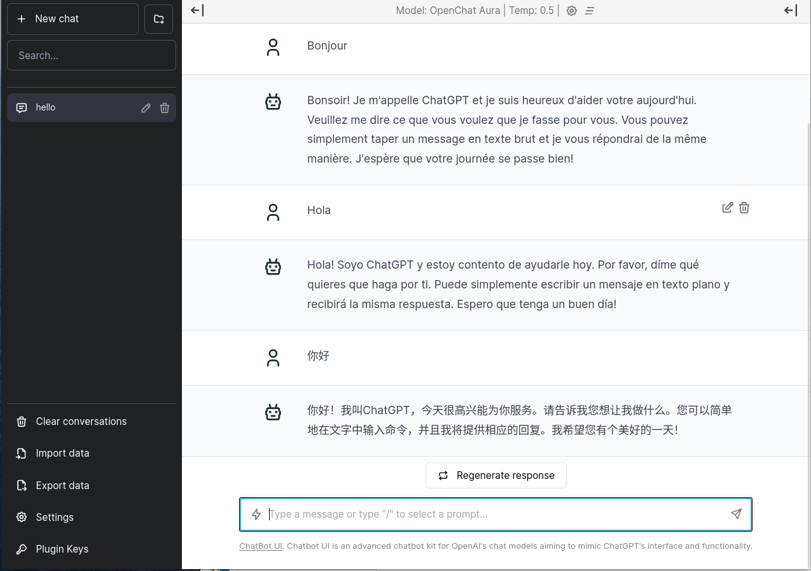
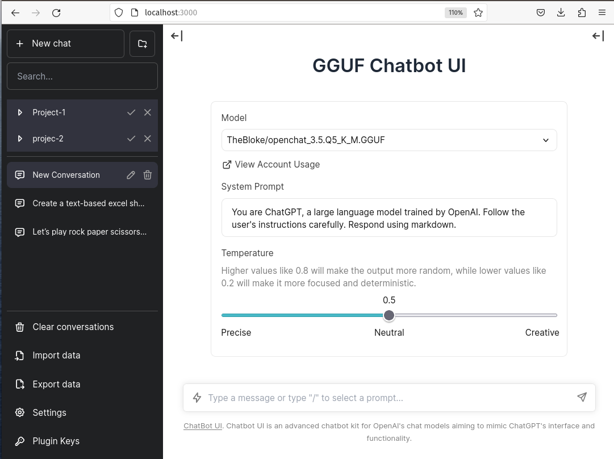

# ChatGPT Like Experience Offline

**Motivation**: One year later, what is like be able run chatgpt like capable model locally / offline

mimic chatgpt like experience locally using latest open source LLM models for free.
in 3 easy steps

- step-1. select the model server you like based on your hardware
- step-2. start chatbot UI
- step-3. launch browser http://localhost:3000





# Open Source Models

**Benchmark**

- [OpenChat](https://github.com/imoneoi/openchat/blob/master/assets/openchat.png)
claims "The first 7B model that Achieves Comparable Results with ChatGPT (March)!"
- [Zephyr](https://huggingface.co/HuggingFaceH4/zephyr-7b-beta) claims the highest ranked 7B chat model on the MT-Bench and AlpacaEval benchmarks:
- [Mistral-7B](https://arxiv.org/abs/2310.06825) claims outperforms Llama 2 13B across all evaluated benchmarks and Llama 1 34B in reasoning, mathematics, and code generation. 

**There are so many opensource LLM out there, which one is good?**
see compare the performance of different LLM that can be deployed locally on consumer hardware. 
try it yourself in google colab include free GPU 
[Local-LLM-Comparison-Colab-UI](https://github.com/Troyanovsky/Local-LLM-Comparison-Colab-UI)


# 1.Run Full Model Server

<details>
  <summary>Setup Full Openchat Model Server vLLM (click to expand)</summary>

Requirement: must have a GPU with 24GB vram
Experience:  ChatGPT 3.5 like fast inference speed

```bash
## create environment
conda create -y --name openchat
conda activate openchat
conda install -y python=3.11
pip3 install torch torchvision torchaudio
pip3 install ochat

## run openchat server 
python -m ochat.serving.openai_api_server --model openchat/openchat_3.5 --engine-use-ray --worker-use-ray

```
</details>


# 1.Run Quantized Model Server in GGUF format     
here's some example models, it can be any other open source models in GGUF format.

Note: adjust OFFLOAD_GPU_LAYERS value based on your GPU ram
```
OFFLOAD_GPU_LAYERS=0   # use CPU only 
OFFLOAD_GPU_LAYERS=16  # move 16 layers to GPU and rest in CPU
OFFLOAD_GPU_LAYERS=35  # move 35 layers to GPU  
```
<details>
  <summary>Setup Llama_cpp_python GGUF Model Server (click to expand)</summary>

- Requirement: flexible GPU or CPU only or mixed offloading
- Experience:  varies depends on the type of model

```bash
## create environment
virtualenv venv --python=3.10

pip3 install torch torchvision torchaudio

## install llama-cpp-python (for your environment)
(for example in linux with cuda support )
### Install Server with OpenAI Compatible API - with CUDA GPU support
CMAKE_ARGS="-DLLAMA_CUBLAS=on" FORCE_CMAKE=1 pip install llama-cpp-python[server]

CMAKE_ARGS="-DLLAMA_CUBLAS=on -DBUILD_SHARED_LIBS=ON" FORCE_CMAKE=1 pip install llama-cpp-python[server] --force-reinstall --upgrade --no-cache-dir

```
</details>

## Using Zephyr-7B
<details>
  <summary>run server with Zephyr-7B (click to expand)</summary>
echo "serving [Zerphyr] - multilingual model"

export MODEL_FILE="./models/zephyr-7b-beta.Q5_K_M.gguf"
export MODEL_ID="TheBloke/zephyr-7B-beta.Q5_K_M.gguf"
export OFFLOAD_GPU_LAYERS=35   
export HOST=0.0.0.0
export PORT=8000
export CHAT_FORMAT="chatml"
export CONTEXT_SIZE=4096

python3 -m llama_cpp.server \
--n_gpu_layers $OFFLOAD_GPU_LAYERS \
--model $MODEL_FILE \
--model_alias $MODEL_ID \
--chat_format $CHAT_FORMAT \
--n_ctx $CONTEXT_SIZE \
--host $HOST \
--port $PORT \
--seed 123
</details>

## Using Mistral
<details>
  <summary>run server with Mistral-7B (click to expand)</summary>
echo "serving [mistral 7b]"

export MODEL_FILE="./models/mistral-7b-instruct-v0.1.Q5_K_M.gguf"
export MODEL_ID="TheBloke/mistral-7b-instruct-v0.1.Q5_K_M.GGUF"
export OFFLOAD_GPU_LAYERS=35
export HOST=0.0.0.0
export PORT=8000
export CHAT_FORMAT="vicuna"
export CONTEXT_SIZE=4096

python3 -m llama_cpp.server \
--n_gpu_layers $OFFLOAD_GPU_LAYERS \
--model $MODEL_FILE \
--model_alias $MODEL_ID \
--chat_format $CHAT_FORMAT \
--n_ctx $CONTEXT_SIZE \
--host $HOST \
--port $PORT \
--seed 123
</details>

## Using openchat-3.5
<details>
  <summary>run server with Openchat-3.5 (click to expand)</summary>
echo "serving [openchat 3.5]"

export MODEL_FILE="./models/openchat_3.5.Q5_K_M.gguf"
export MODEL_ID="TheBloke/openchat_3.5.Q5_K_M.GGUF"
export OFFLOAD_GPU_LAYERS=35
export HOST=0.0.0.0
export PORT=8000
#export CHAT_FORMAT="llama-2"
export CHAT_FORMAT="vicuna"
export CONTEXT_SIZE=4096

python3 -m llama_cpp.server \
--n_gpu_layers $OFFLOAD_GPU_LAYERS \
--model $MODEL_FILE \
--model_alias $MODEL_ID \
--chat_format $CHAT_FORMAT \
--n_ctx $CONTEXT_SIZE \
--host $HOST \
--port $PORT \
--seed 123

</details>


# 2.Running Chatbot Web UI 

<details>
  <summary>Setup ChatBot UI (click to expand)</summary>

Requirement: nodejs 18.x
Experience:  ChatGPT 3.5 like User Experience in chatting

```bash
## create environment
curl -fsSL https://deb.nodesource.com/setup_18.x | sudo -E bash -
sudo apt install -y nodejs
node --version
npm --version

## run chatbotui server 
echo "GGUF Chatbot UI"
export NEXT_PUBLIC_DEFAULT_SYSTEM_PROMPT="You are ChatGPT, a large language model trained by OpenAI. Follow the user's instructions carefully. Respond using markdown"
export NEXT_PUBLIC_DEFAULT_TEMPERATURE=0.5
export DEFAULT_MODEL=gpt-3.5-turbo
export OPENAI_API_KEY=EMPTY
export OPENAI_API_TYPE=openai

## openchat vllm server
#export OPENAI_API_HOST=http://localhost:18888
## llama_cpp_python GGUF file server
export OPENAI_API_HOST=http://127.0.0.1:8000
cd gguf-chatbot-ui
npm install
npm run dev

```
</details>


# Credits: 

All contributor in open source projects including llama.cpp, llama_cpp_python and chatbot.ui for their awesome work.


